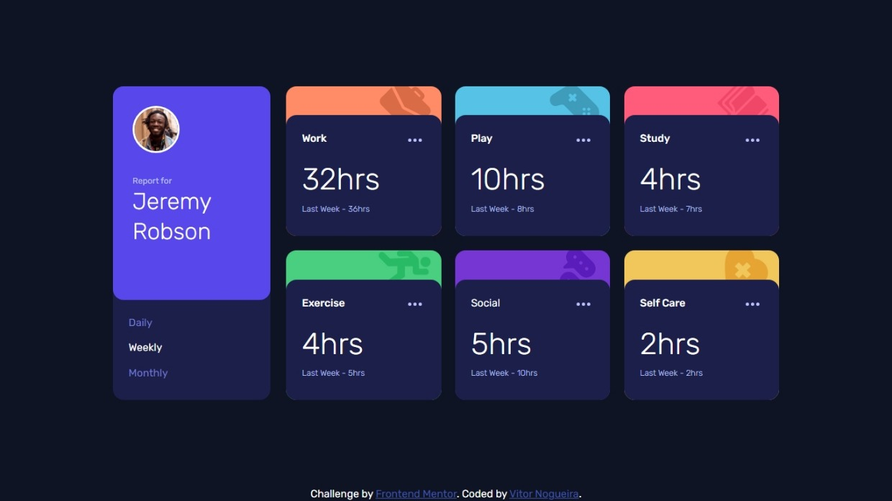

# Frontend Mentor - Time tracking dashboard solution

This is a solution to the [Time tracking dashboard challenge on Frontend Mentor](https://www.frontendmentor.io/challenges/time-tracking-dashboard-UIQ7167Jw). Frontend Mentor challenges help you improve your coding skills by building realistic projects. 

## Table of contents

- [Overview](#overview)
  - [The challenge](#the-challenge)
  - [Screenshot](#screenshot)
  - [Links](#links)
- [My process](#my-process)
  - [Built with](#built-with)
  - [What I learned](#what-i-learned)
  - [Continued development](#continued-development)
  - [AI Collaboration](#ai-collaboration)
- [Author](#author)

## Overview

### The challenge

Users should be able to:

- View the optimal layout for the site depending on their device's screen size
- See hover states for all interactive elements on the page
- Switch between viewing Daily, Weekly, and Monthly stats

### Screenshot

### Links

- Solution URL: [https://github.com/VitorEmanoelNogueira/time-tracking-dashboard](https://github.com/VitorEmanoelNogueira/time-tracking-dashboard)
- Live Site URL: [https://vitoremanoelnogueira.github.io/time-tracking-dashboard/](https://vitoremanoelnogueira.github.io/time-tracking-dashboard/)

## My process

### Built with

- Semantic HTML5 markup;
- OOCSS, BEM, SMACSS, namespaces;
- CSS custom properties;
- Flexbox;
- CSS Grid;
- Mobile-first workflow.

### What I learned

- Improved BEM usage for component management;
- How to create the cards background effect with wrappers;
- Using filter: brightness() for hover styles
- Dataset usage;
- How to use the spread operator to turn a NodeList into an Array and use its methods;
- Better ways to work with fetched data.

### Continued development

- Improve planning and execution in future projects.
- Apply interleaving to strengthen mastery and consistency.

### AI Collaboration

Describe how you used AI tools (if any) during this project. This helps demonstrate your ability to work effectively with AI assistants.

- **Tool used:** ChatGPT.
- **How it helped:** Brainstorming solutions, clarifying concepts, and refining my thought process while solving problems.

## Author

- Frontend Mentor - [@VitorEmanoelNogueira](https://www.frontendmentor.io/profile/VitorEmanoelNogueira)